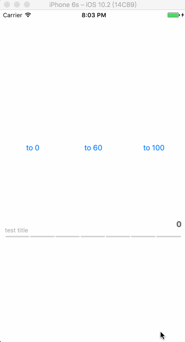

# UIMultiSpaceBar

UIMultiSpaceBar, Swift, Animations:A bar which is made up of multi parts and it can change progress view and text by way of Animation.

## Overview

## Requirements

- XCode 8.0+
- Swift 3.0+

## Author

EyreFree, eyrefree@eyrefree.org

## License

UIMultiSpaceBar is available under the MIT license. See the LICENSE file for more info.
